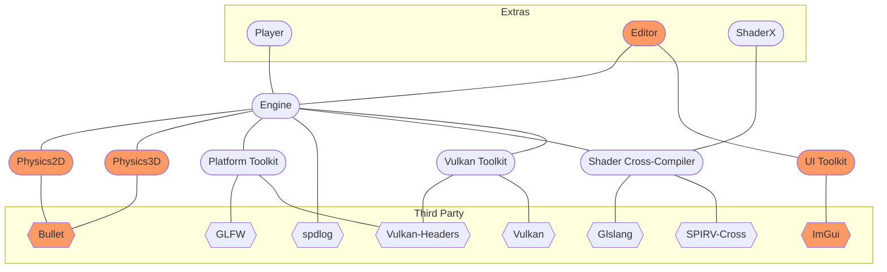
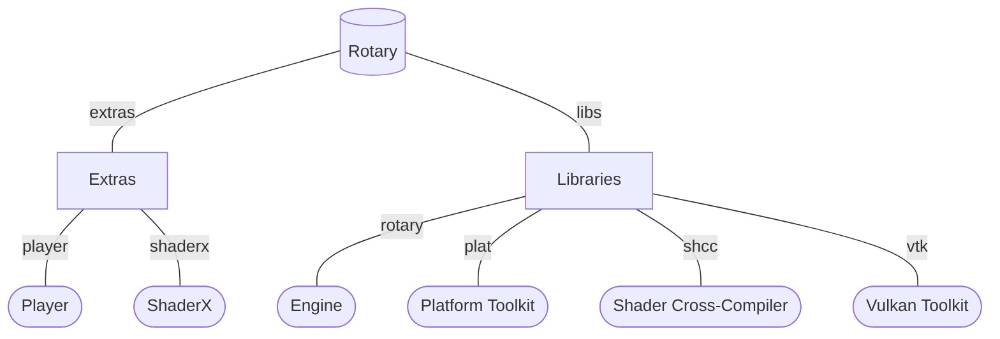

# Intro

## Project Structure

```mermaid
flowchart TD
    subgraph "Extras"
        player([Player])
        editor([Editor])
        shaderx([ShaderX])
    end

    engine([Engine])
    p2d([Physics2D])
    p3d([Physics3D])
    plat([Platform Toolkit])
    shcc([Shader Cross-Compiler])
    uitk([UI Toolkit])
    vtk([Vulkan Toolkit])

    subgraph "Third Party"
        bullet{{Bullet}}
        imgui{{ImGui}}
        glfw{{GLFW}}
        glslang{{Glslang}}
        spdlog{{spdlog}}
        spirv_cross{{SPIRV-Cross}}
        vulkan_headers{{Vulkan-Headers}}
        vulkan{{Vulkan}}
    end

    player --- engine
    editor --- engine & uitk
    shaderx --- shcc

    engine --- p2d & p3d & plat & spdlog & shcc & vtk
    p2d --- bullet
    p3d --- bullet
    plat --- glfw & vulkan_headers
    shcc --- glslang & spirv_cross
    uitk --- imgui
    vtk --- vulkan_headers & vulkan

    click bullet "https://github.com/bulletphysics/bullet3" _blank
    click imgui "https://github.com/ocornut/imgui" _blank
    click glfw "https://www.glfw.org/" _blank
    click glslang "https://github.com/KhronosGroup/glslang" _blank
    click spirv_cross "https://github.com/KhronosGroup/SPIRV-Cross" _blank
    click spdlog "https://github.com/gabime/spdlog" _blank
    click vulkan_headers "https://github.com/KhronosGroup/Vulkan-Headers" _blank
    click vulkan "https://github.com/KhronosGroup/Vulkan-Loader" _blank

    style editor fill:#f96

    style p2d fill:#f96
    style p3d fill:#f96
    style uitk fill:#f96

    style bullet fill:#f96
    style imgui fill:#f96
```

## Directory Structure

```mermaid
flowchart TD
    rotary[(Rotary)]

    extras[Extras]
    player([Player])
    shaderx([ShaderX])

    libs[Libraries]
    engine([Engine])
    plat([Platform Toolkit])
    shcc([Shader Cross-Compiler])
    vtk([Vulkan Toolkit])

    rotary -- extras --- extras
    rotary -- libs --- libs

    extras -- player --- player
    extras -- shaderx --- shaderx

    libs -- rotary --- engine
    libs -- plat --- plat
    libs -- shcc --- shcc
    libs -- vtk --- vtk
```