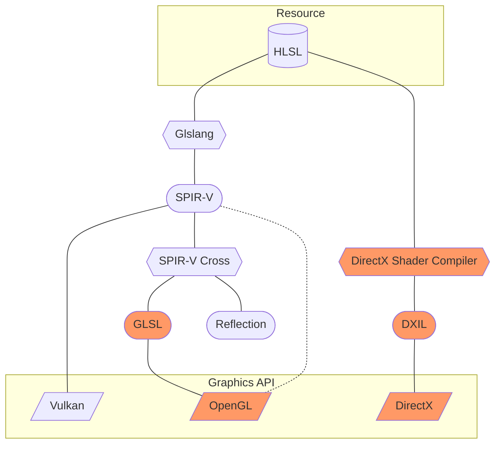

# Shader Cross-Compiler

```cpp
#include <shcc/shcc.hpp>
```

## Purpose

The Shader Cross-Compilater library is resposible for handling the loading, compiling, translating, and analysis of shaders.
Because the Rotary aims to support multiple graphics APIs, multiple shader formats will be needed as well.

### Pipeline



# Usage

```cpp
void callback(const std::string& message);
std::string source; // HLSL source

// ...

std::shared_ptr<shcc::Runtime> runtime = shcc::runtime(callback);

shcc::Package package = runtime->package(source, { shcc::Stage::Vertex, shcc::Stage::Fragment });

std::vector<uint8_t> vertexSpvBinary = package.compile(shcc::Stage:Vertex, shcc::Language::Spirv);
std::span<uint32_t> binary(reinterpret_cast<const uint32_t*>(vertexSpvBinary.data()), vertexSpvBinary.size() / 4);

shcc::Resources resoucres = package.resources(); // Reflection information
```

:::info
Although shader `shcc::Package`s do depend on their corresponding `shcc::Runtime` to function, they hold a `std::shared_ptr<shcc::Runtime>`
internally, preventing it from being destructed beforehand.
:::