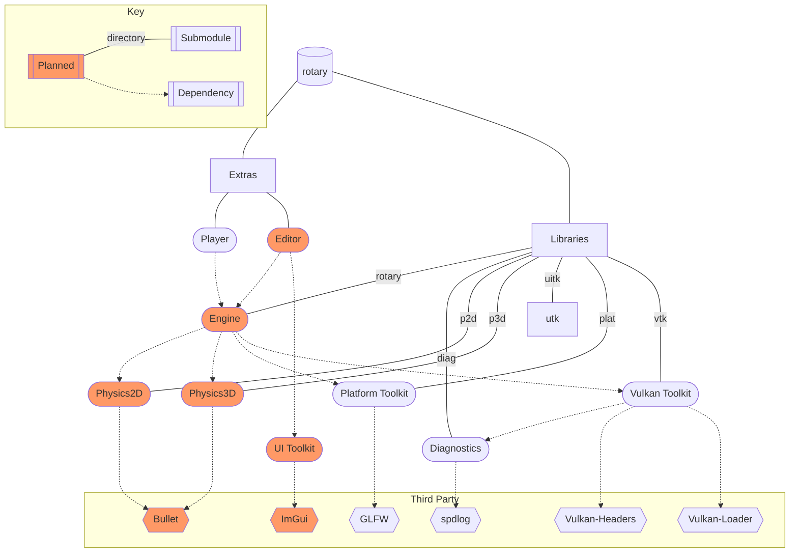

# Project Structure

```mermaid
flowchart TD
    rotary[(rotary)]

    extras[Extras]
    player([Player])
    editor([Editor])

    libs[Libraries]
    diag([Diagnostics])
    engine([Engine])
    p2d([Physics2D])
    p3d([Physics3D])
    plat([Platform Toolkit])
    uitk([UI Toolkit])
    vtk([Vulkan Toolkit])

    subgraph "Third Party"
        bullet{{Bullet}}
        imgui{{ImGui}}
        glfw{{GLFW}}
        spdlog{{spdlog}}
        vulkan_headers{{Vulkan-Headers}}
        vulkan_loader{{Vulkan-Loader}}
    end

    rotary --- extras & libs
    extras --- player & editor
    libs -- rotary --- engine
    libs -- diag --- diag
    libs -- p2d --- p2d
    libs -- p3d --- p3d
    libs -- uitk --- utk
    libs -- plat --- plat
    libs -- vtk --- vtk

    player -.-> engine
    editor -.-> engine & uitk

    diag -.-> spdlog
    engine -.-> p2d & p3d & plat & vtk
    p2d -.-> bullet
    p3d -.-> bullet
    plat -.-> glfw
    uitk -.-> imgui
    vtk -.-> diag & vulkan_headers & vulkan_loader

    click bullet "https://github.com/bulletphysics/bullet3" _blank
    click imgui "https://github.com/ocornut/imgui" _blank
    click glfw "https://www.glfw.org/" _blank
    click spdlog "https://github.com/gabime/spdlog" _blank
    click vulkan_headers "https://github.com/KhronosGroup/Vulkan-Headers" _blank
    click vulkan_loader "https://github.com/KhronosGroup/Vulkan-Loader" _blank

    style editor fill:#f96

    style engine fill:#f96
    style p2d fill:#f96
    style p3d fill:#f96
    style uitk fill:#f96

    style bullet fill:#f96
    style imgui fill:#f96

    planned[[Planned]]
    dependency[[Dependency]]
    submodule[[Submodule]]

    subgraph "Key"
        planned -- directory --- submodule
        planned -.-> dependency
    end

    style planned fill:#f96
```