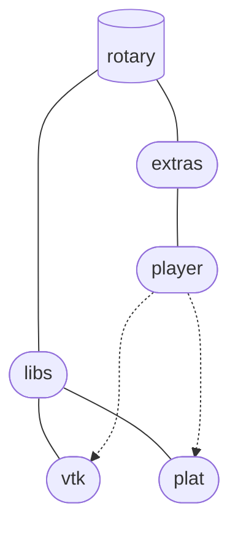

# Project Structure

```mermaid
flowchart TD
    rotary[(rotary)]

    extras([extras])
    player([player])

    libs([libs])
    vtk([vtk])
    plat([plat])

    rotary --- extras & libs
    extras --- player
    libs --- vtk & plat

    player -..-> vtk & plat
```